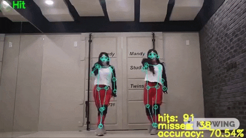
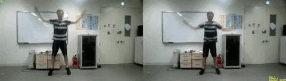

## Dance Comparison using PoseNet Pytorch 

This repository contains a PyTorch implementation (multi-pose only) of the Google TensorFlow.js Posenet model.

This port is based on Tensorflow Python (https://github.com/rwightman/posenet-python) conversion of the same model. An additional step of the algorithm was performed on the GPU in this implementation so it is faster and consumes less CPU (but more GPU). On a GTX 1080 Ti (or better) it can run over 130fps.

Further optimization is possible as the MobileNet base models have a throughput of 200-300 fps.

### Install

A suitable Python 3.x environment with a recent version of PyTorch is required. Development and testing was done with Python 3.7.1 and PyTorch 1.0 w/ CUDA10 from Conda.

If you want to use the webcam demo, a pip version of opencv (`pip install python-opencv=3.4.5.20`) is required instead of the conda version. Anaconda's default opencv does not include ffpmeg/VideoCapture support. The python bindings for OpenCV 4.0 currently have a broken impl of drawKeypoints so please force install a 3.4.x version.

A fresh conda Python 3.6/3.7 environment with the following installs should suffice: 
```
conda install -c pytorch pytorch cuda100
pip install opencv-python==3.4.5.20
```

#### duo_demo.py 
duo demo takes one video that is alligned in time and calculates the accuracy between the model and target over time. Video named "project" will be automatically saved into directory after python file finishes running.  (the video file path for the duo video must be specified in the python file)

`python time_independent_demo

View Sample Output: https://www.youtube.com/watch?v=YxT1fg0QJHU 


#### time_independent_demo.py 

Time Independent demo takes two unalligned videos finds the highest accuracy between them and outputs a video of how accuracte the two videos are over time. Video named "project_time" will be automatically saved into directory after python file finishes running. (the video file paths for model and target must be specified in the python file)

`python time_independent_demo.py 

View Sample Output: https://www.youtube.com/watch?v=QOZejA8n300


#### webcam_demo.py

The webcam demo uses OpenCV to capture images from a connected webcam. The result is overlayed with the keypoints and skeletons and rendered to the screen. The default args for the webcam_demo assume device_id=0 for the camera and that 1280x720 resolution is possible. A video will automatically be saved to the project directory after the demo finishes running.


### Credits

The unofficial python plugin for PoseNet using PyTorch 
https://github.com/rwightman/posenet-pytorch

### TODO (someday, maybe)
* Optimize the duo_demo program file
* Optimize the time_independent demo program file

